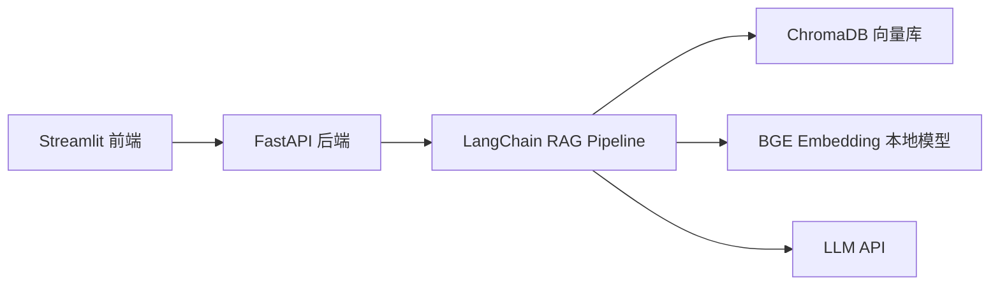
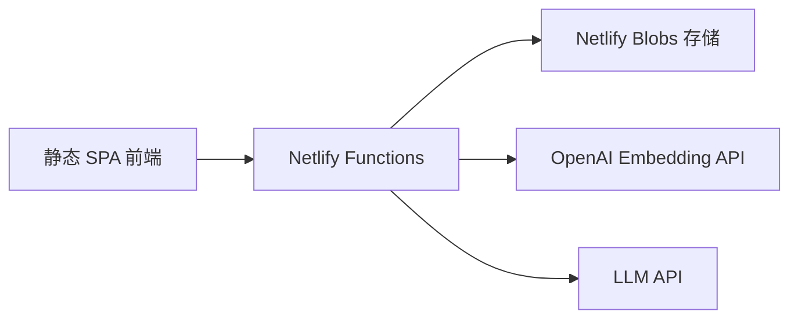

# 📚 RAG 知识库 · 企业文档智能问答

基于检索增强生成（RAG）的企业文档智能问答平台。上传文档，向 AI 提问，获取带引用来源的精准回答。

[](https://app.netlify.com/sites/inquisitive-empanada-8e16eb/deploys)
[](LICENSE)

**🌐 在线体验：[rag.inquisitive-empanada-8e16eb.netlify.app](https://inquisitive-empanada-8e16eb.netlify.app)**

---

## ✨ 功能特性

- **多格式文档上传** — PDF / Word / Markdown / TXT，自动解析与分块
- **智能检索增强** — LangChain RAG pipeline，HyDE 技术提升召回率
- **流式回答** — SSE 流式传输，实时展示 AI 回答生成过程
- **引用来源** — 每个回答附带可追溯的文档引用
- **多轮对话** — 上下文记忆，支持连续追问与深度探索
- **自带 API Key** — 使用您自己的 DeepSeek / OpenAI / 兼容接口的 API Key

---

## 🏗️ 架构

本项目支持两种运行模式：

### 本地模式（Python）



### Netlify 无服务器模式（TypeScript）



---

## 🚀 快速开始

### 在线使用（推荐）

直接访问 **[rag.inquisitive-empanada-8e16eb.netlify.app](https://inquisitive-empanada-8e16eb.netlify.app)**，填入 API Key 即可使用。

### 本地运行

```bash
# 1. 安装依赖
pip install -r requirements.txt
npm install

# 2. 配置环境变量
cp .env.example .env
# 编辑 .env，填入 LLM 相关配置

# 3. 启动后端
python run.py api

# 4. 启动前端（新终端）
python run.py ui
```

然后访问 http://localhost:8501

---

## 🛠️ 技术栈

| 层级 | 本地模式 | Netlify 模式 |
|------|----------|-------------|
| 前端 | Streamlit | 静态 HTML/CSS/JS (SPA) |
| 后端 | FastAPI + Uvicorn | Netlify Functions (TypeScript) |
| RAG 框架 | LangChain | 自研 |
| 向量库 | ChromaDB | Netlify Blobs |
| 嵌入模型 | BGE-small-zh-v1.5 | OpenAI Embedding API |
| LLM | 用户自带 API Key | 用户自带 API Key |
| 文档解析 | PyPDF / python-docx | pdf-parse / mammoth |

---

## 📁 项目结构

```
RAG知识库/
├── app/                    # Python 后端
│   ├── api/routes.py       # FastAPI 路由
│   ├── core/config.py      # 全局配置
│   ├── rag/                # RAG 核心
│   │   ├── pipeline.py     # 主流水线
│   │   ├── generator.py    # 答案生成
│   │   ├── retriever.py    # 混合检索
│   │   ├── embedding.py    # 向量嵌入
│   │   ├── loader.py       # 文档加载
│   │   ├── splitter.py     # 文档分块
│   │   ├── rewriter.py     # 查询改写
│   │   ├── hyde.py         # HyDE 增强
│   │   └── reranker.py     # 重排序
│   ├── memory/memory.py    # 对话记忆
│   └── utils/citation.py   # 引用追溯
├── frontend/
│   ├── app.py              # Streamlit 前端
│   └── app_gradio.py       # Gradio 备用前端
├── netlify/functions/      # Netlify 无服务器部署
│   ├── api/api.mts         # API 函数
│   └── _shared/            # 共享模块
├── deploy/                 # 静态前端 + 截图
├── scripts/                # 工具脚本
├── run.py                  # 启动入口
├── requirements.txt        # Python 依赖
└── package.json            # Node.js 依赖
```

---

## 📄 License

MIT © 袁佳宝